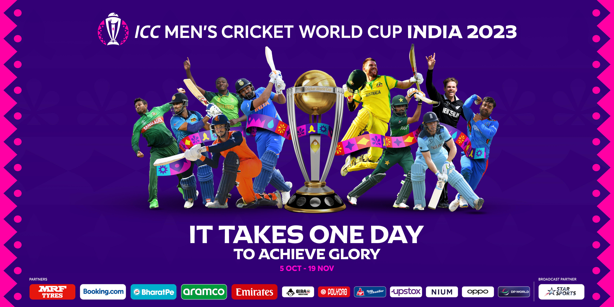
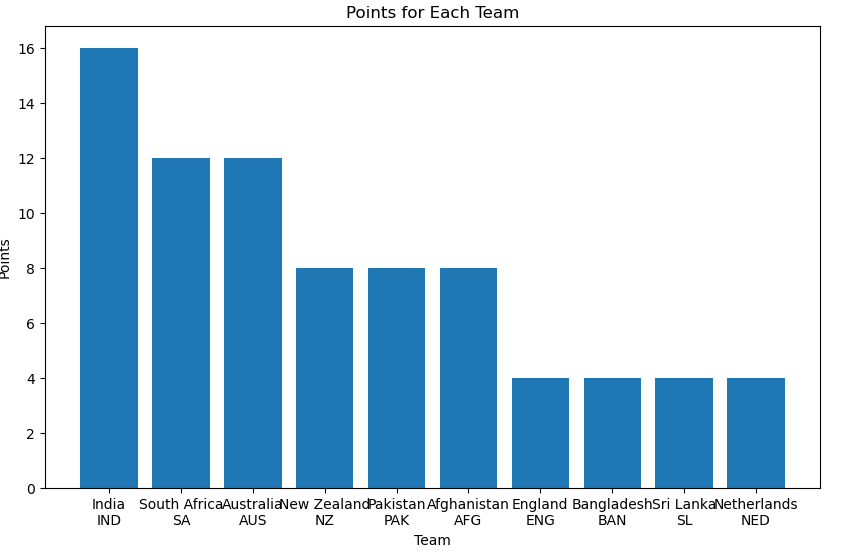
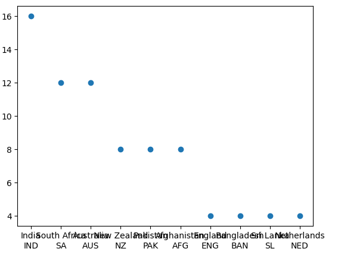
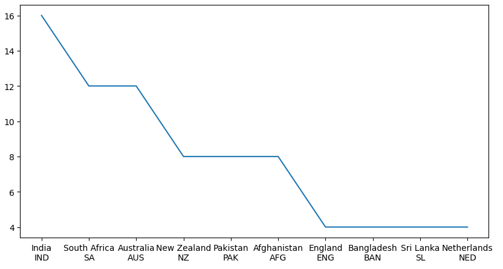
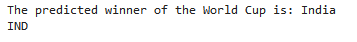
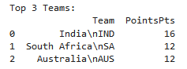

# ICC Cricket World Cup 2023 Winner Predictor



# Overview

This project leverages data analysis and web scraping techniques using Python to predict the winner of the ICC Cricket World Cup 2023. By combining historical performance data of participating teams and real-time statistics, the project aims to provide insights into the potential outcome of the tournament. (The data utilized is current as of November 9, 2023)

# Key features

**Web Scraping** : Employing web scraping methodologies using python, the project acquires current information on team performance as of November 9, 2023, sourced from the official ICC website at https://www.cricketworldcup.com/standings <br> <br>
**Data Analysis** : Leveraging Jupyter Notebook, the gathered data undergoes exploratory data analysis (EDA), enabling a comprehensive exploration of tournament patterns within the dataset <br> <br>
**Prediction Model** : A visualizable predictive model is developed to draw conclusions regarding the anticipated winner of the tournament <br> <br>

# How to Use?

**1. Clone the Repository:**

```bash
git clone https://github.com/Jayavelrajan/WorldCup2023Prediction.git
cd WorldCup2023Prediction
```

**2. Install Dependencies:**

For Web Scraping
```bash
from bs4 import BeautifulSoup
import requests
```
For data analysis and visualization
```bash
import pandas as pd
import matplotlib.pyplot as plt
```

**3. Run the Jupyter Notebook**

Open and run the Jupyter Notebook file (CricketWorldCup2023.ipynb) to view the data analysis process and predictions.


# Data Sources

The project relies on web scraping techniques to extract data from official ICC Cricket World Cup 2023 website --> www.cricketworldcup.com/standings

# Results and Insights


Bar Graph : 
 

Scatter plot : 



Line Graph : 


Predicted Winner 🏆 :


Top 3 Positions : 



UPDATE : Regrettably, the prediction has proven to be inaccurate. The winning team in the ICC Cricket World Cup 2023 is Australia.


# License

This project is licensed under the MIT License.

Feel free to customize this overview based on the specific details and nuances of your ICC Cricket World Cup 2023 prediction project.


